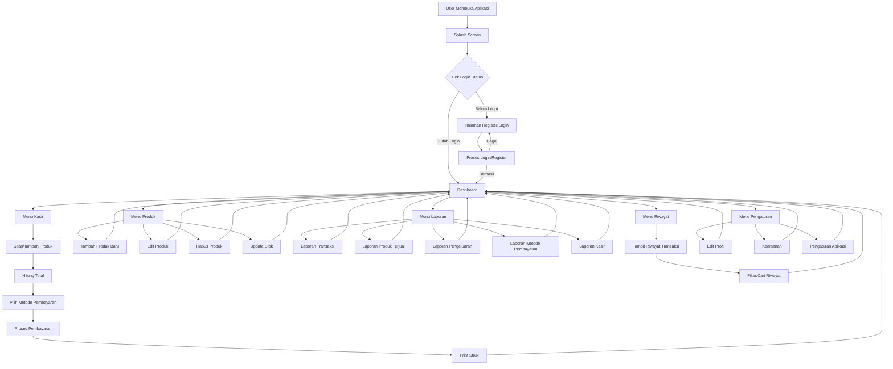
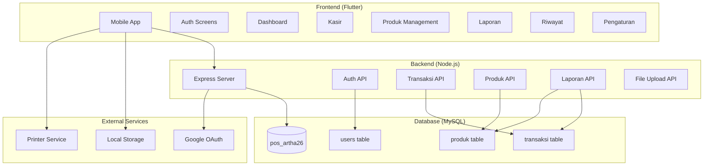
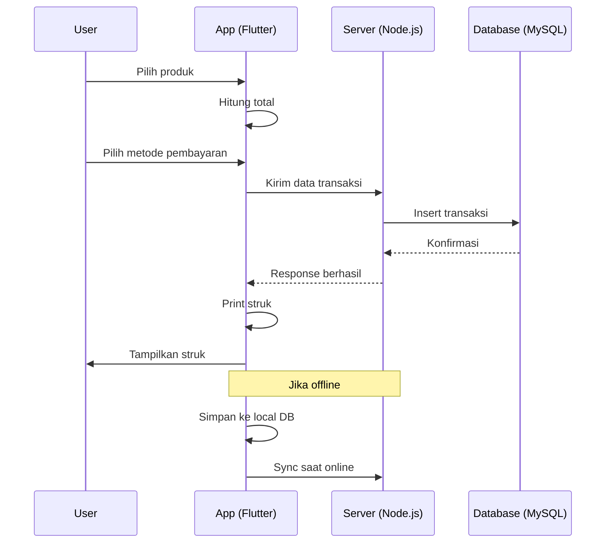
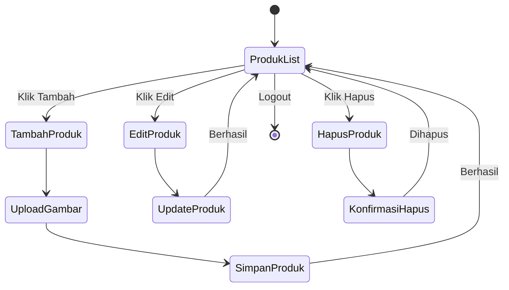

# Flowchart Sistem POS Artha26

Berikut adalah flowchart yang menggambarkan alur kerja sistem Point of Sale (POS) Artha26.

> **Catatan**: Diagram di bawah menggunakan syntax Mermaid yang didukung langsung oleh GitHub untuk rendering visual. Jika tidak terlihat, pastikan browser Anda mendukung Mermaid atau gunakan ekstensi yang sesuai.

## Diagram Alur Sistem Utama



### Alternatif ASCII Art (jika Mermaid tidak terender):

```
User Membuka Aplikasi
         |
    Splash Screen
         |
    Cek Login Status
    /            \
Belum Login     Sudah Login
    |               |
Register/Login --> Dashboard
    ^               |
    |               |
 Gagal Login        |
                    |
          +---------+---------+
          |         |         |
       Kasir    Produk   Laporan
          |         |         |
     Tambah --> Edit --> Laporan
    Produk    Produk   Transaksi
         |         |         |
    Hitung --> Update --> dll.
    Total     Stok
         |
   Pilih Pembayaran
         |
   Proses Pembayaran
         |
    Print Struk
         |
    Kembali ke Dashboard
```

## Diagram Arsitektur Sistem



### Alternatif ASCII Art Arsitektur:

```
+-------------------+     +-------------------+     +-------------------+
|   Frontend        |     |   Backend         |     |   Database        |
|   (Flutter)       | --> |   (Node.js)       | --> |   (MySQL)         |
|                   |     |                   |     |                   |
| - Auth Screens    |     | - Express Server  |     | - users table     |
| - Dashboard       |     | - Auth API        |     | - transaksi table |
| - Kasir           |     | - Transaksi API   |     | - produk table    |
| - Produk Mgmt     |     | - Produk API      |     |                   |
| - Laporan         |     | - Laporan API     |     +-------------------+
| - Riwayat         |     | - File Upload API |             ^
| - Pengaturan      |     +-------------------+             |
+-------------------+             |                        |
                                 |                        |
                    +------------+------------------------+
                    |            |
                    v            v
         +-------------------+  +-------------------+
         |  Google OAuth     |  |  Local Storage    |
         +-------------------+  +-------------------+
                    |
                    v
         +-------------------+
         |  Printer Service  |
         +-------------------+
```

## Diagram Alur Transaksi



### Alternatif ASCII Art Transaksi:

```
User --> App: Pilih produk
App --> App: Hitung total
User --> App: Pilih metode pembayaran
App --> Server: Kirim data transaksi
Server --> Database: Insert transaksi
Database --> Server: Konfirmasi
Server --> App: Response berhasil
App --> App: Print struk
App --> User: Tampilkan struk

Catatan: Jika offline, simpan ke local DB dan sync saat online
```

## Diagram Alur Produk Management



### Alternatif ASCII Art Produk Management:

```
[*] --> ProdukList
ProdukList --> TambahProduk : Klik Tambah
ProdukList --> EditProduk : Klik Edit
ProdukList --> HapusProduk : Klik Hapus

TambahProduk --> UploadGambar
UploadGambar --> SimpanProduk
SimpanProduk --> ProdukList : Berhasil

EditProduk --> UpdateProduk
UpdateProduk --> ProdukList : Berhasil

HapusProduk --> KonfirmasiHapus
KonfirmasiHapus --> ProdukList : Dihapus

ProdukList --> [*] : Logout
```

## Penjelasan Flowchart

### Sistem Utama:
1. **Splash Screen**: Halaman pembuka aplikasi
2. **Authentication**: Login/Register untuk akses sistem
3. **Dashboard**: Menu utama dengan navigasi ke berbagai fitur
4. **Kasir**: Proses transaksi penjualan
5. **Produk**: Manajemen inventori produk
6. **Laporan**: Berbagai jenis laporan bisnis
7. **Riwayat**: Riwayat transaksi
8. **Pengaturan**: Konfigurasi aplikasi dan profil

### Arsitektur:
- **Frontend**: Aplikasi mobile Flutter
- **Backend**: Server API Node.js dengan Express
- **Database**: MySQL untuk penyimpanan data
- **Services**: Integrasi dengan Google OAuth, storage lokal, dan printer

### Alur Khusus:
- **Transaksi**: Dari pemilihan produk hingga pembayaran dan struk
- **Produk**: CRUD operations untuk manajemen produk

Flowchart ini memberikan gambaran komprehensif tentang bagaimana sistem POS Artha26 bekerja dari perspektif user dan teknis.

> **Tips untuk GitHub**: Jika diagram Mermaid tidak muncul, Anda bisa:
> 1. Menggunakan browser yang mendukung Mermaid
> 2. Menginstall ekstensi browser seperti "Mermaid Preview"
> 3. Menggunakan alternatif ASCII art yang disediakan di atas